# 1.项目介绍
- 系统角色：管理员、商家
- 功能模块：用户管理、商家管理、兼职管理、论坛管理、兼职类型、结算类型管理等
- 技术选型：SpringBoot，Vue（后端管理web），uniapp等
- 测试环境：idea2024，jdk1.8，mysql5.7，maven3，Node14.16.1，HbuilderX，微信开发工具
# 2.项目部署
## 2.1 后端部署
- 创建数据库，导入sql文件
- idea打开目录server，根据本地数据库环境修改src/main/resources/application.yml 11-14行
- 启动项目 src/main/java/com/xiaoyuanjianzhiApplication.java
## 2.2 管理web
- idea（安装vue.js插件）或者webstorm、vscode等ide工具打开项目client
- 进入终端，输入 npm  install安装依赖（下载失败自行配置阿里的镜像加速）
- 启动项目 npm run serve
- 打开终端的地址，输入账号密码：admin、123456
## 2.3小程序部署
- 通过微信开发工具，打开项目mp-weixin
- appid配置为你自己小程序的，或者你自己申请的测试小程序appid
- 信任项目即可，如果页面空白，重新编译下
- 说明：mp-weixin是uniapp项目编译后的，如果你想对小程序做一些修改，你可以通过HbuilderX打开.\项目源码\uni-jianzhi，这个是uniapp项目
# 3.项目部分截图
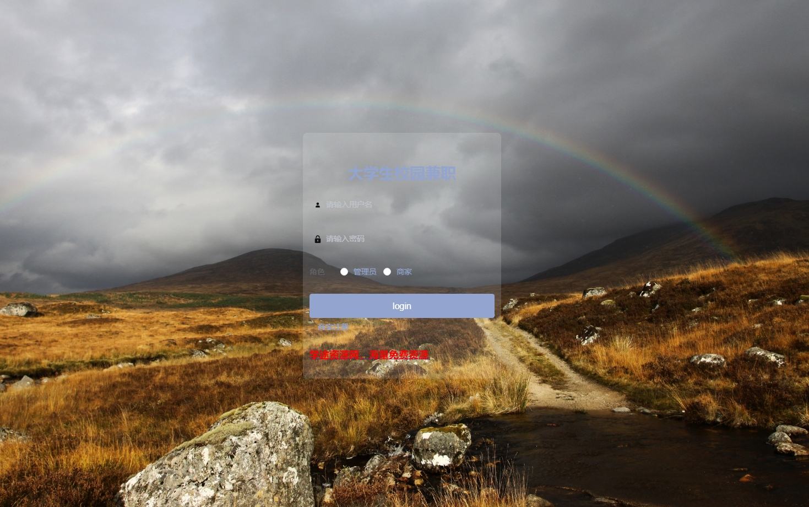
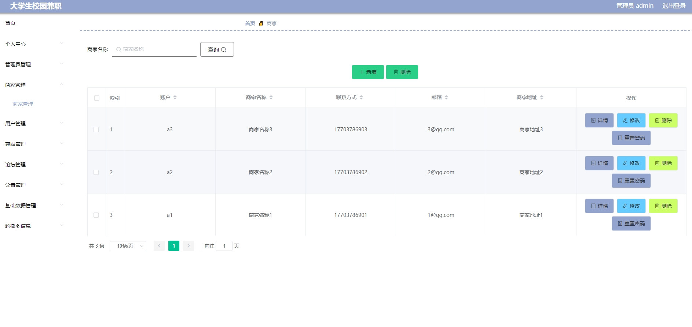
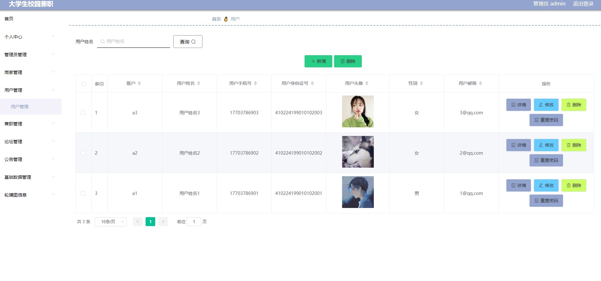
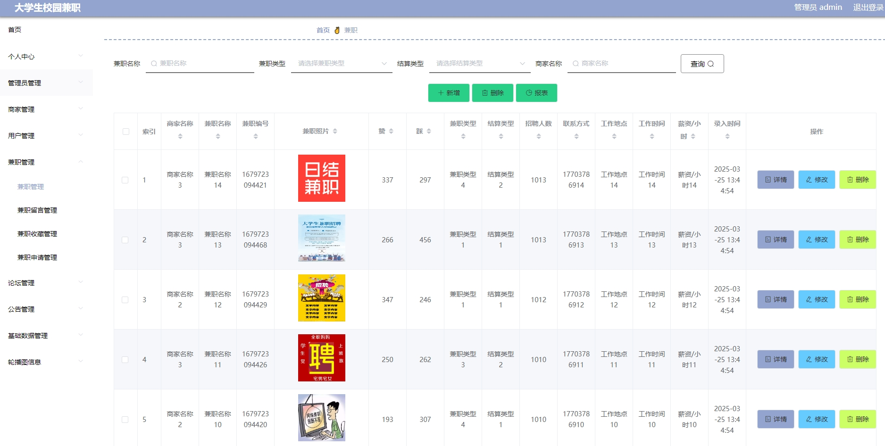
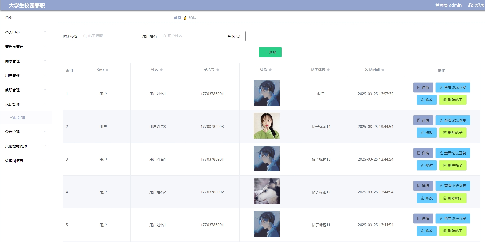
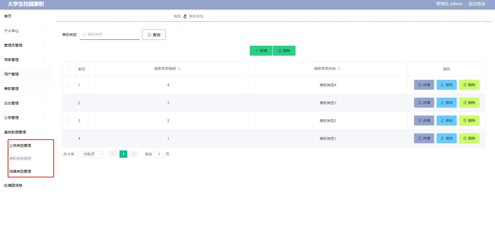
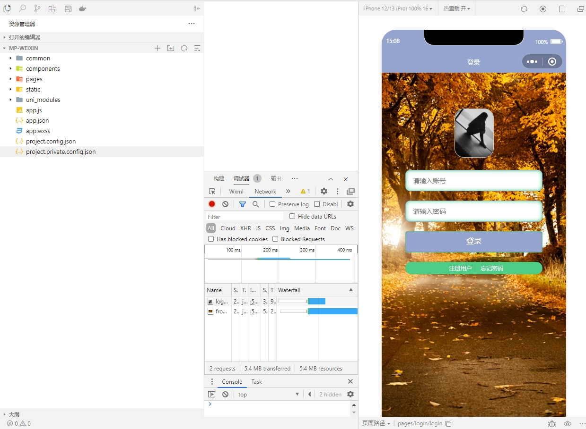
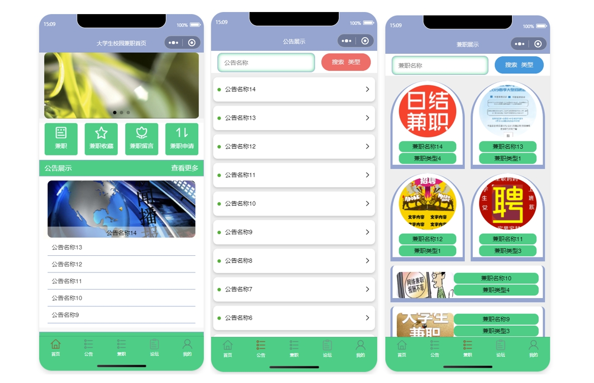
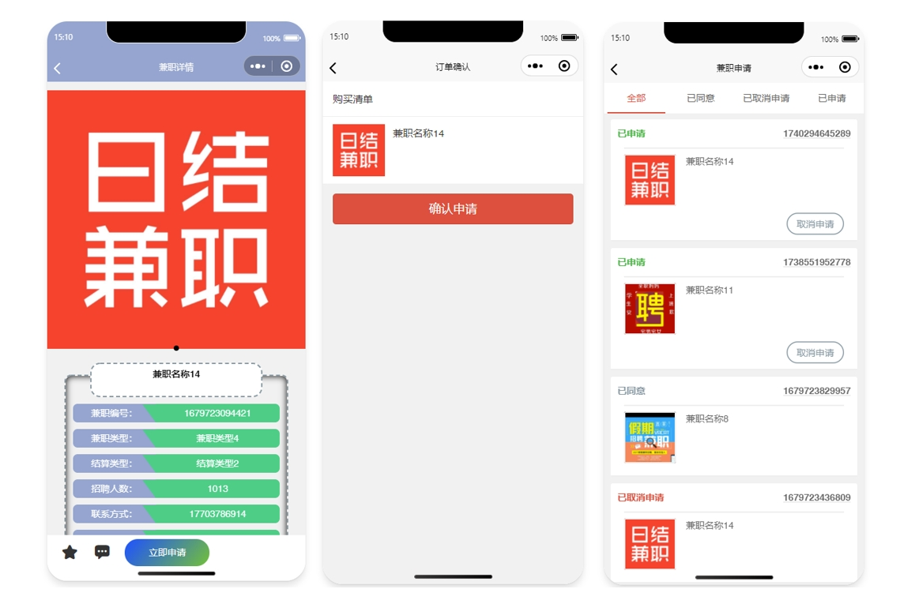
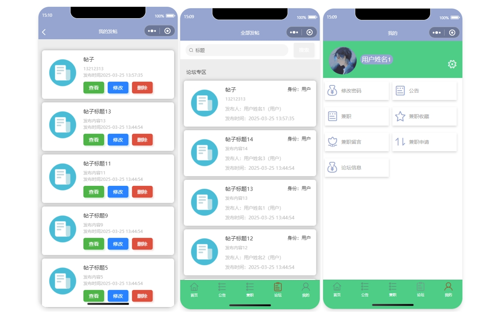
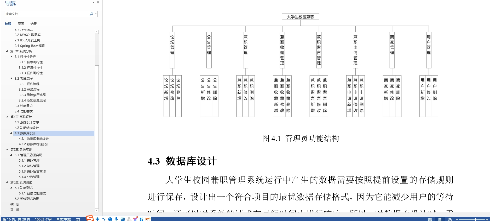

# 4.获取方式
[戳我查看](https://gitee.com/aven999/mall)
